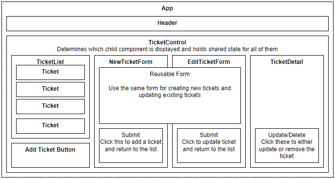

# _Example Help Ticket Queue_

#### By _**Matt C.**_

#### _A practice for using React to show a help queue with full CRUD functionality for support tickets._

## Technologies Used

* _HTML_
* _CSS_
* _JavaScript / JSX_
* _Bootstrap_
* _React_
* _NPM_

## Component Diagram

## Description

_First example project built following along with the lessons for React at Epicodus. Practice using React and functional programming to display different components and CRUD functionality with a pseudo database for help tickets._

## Setup/Installation Requirements

* _Run `git clone https://github.com/catperso/react-help-queue` from the terminal to clone the project directory to your device._
* _Run `npm install` from the terminal in the project directory to set up the environment and install all the npm packages._
* _Run `npm run start` from the terminal to build the project and start a live server._
* _Navigate to `localhost:3000` in your favorite web browser to enjoy the project._

## Known Bugs

* _None so far_

## License - [MIT](https://opensource.org/licenses/MIT)

_If you run into any problems/bugs feel free to send me an email [(mc.casperson@gmail.com)](mailto:mc.casperson@gmail.com) with details._

Copyright (c) _2022_ _Matt C._